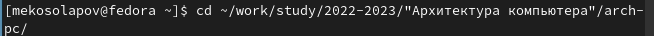
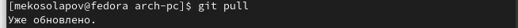
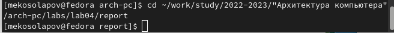
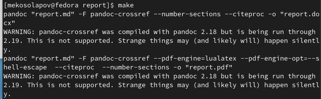
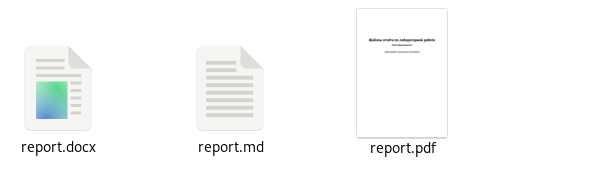
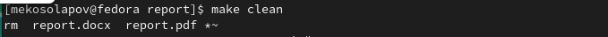
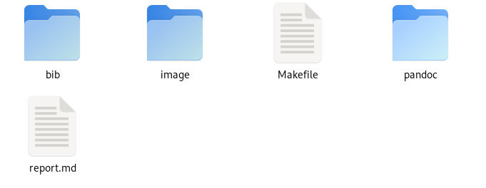
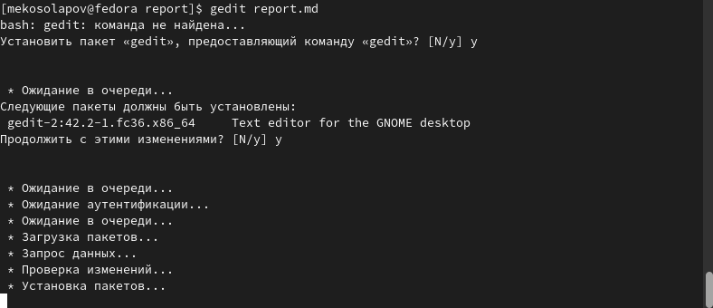
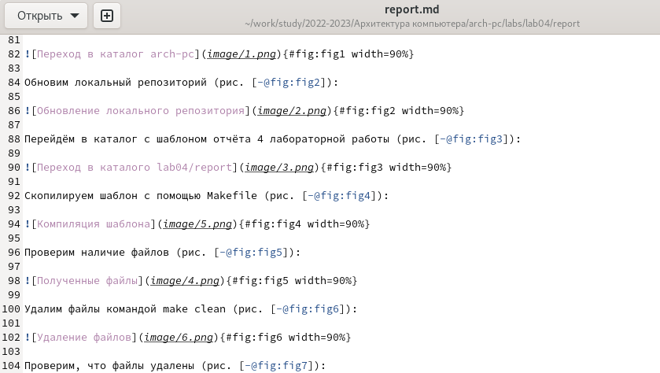

---
## Front matter
title: "Отчёт по лабораторной работе номер 4"
subtitle: "Архитектура компьютера"
author: "Косолапов Матвей Эдуардович"

## Generic otions
lang: ru-RU
toc-title: "Содержание"

## Bibliography
bibliography: bib/cite.bib
csl: pandoc/csl/gost-r-7-0-5-2008-numeric.csl

## Pdf output format
toc: true # Table of contents
toc-depth: 2
lof: true # List of figures
lot: true # List of tables
fontsize: 12pt
linestretch: 1.5
papersize: a4
documentclass: scrreprt
## I18n polyglossia
polyglossia-lang:
  name: russian
  options:
	- spelling=modern
	- babelshorthands=true
polyglossia-otherlangs:
  name: english
## I18n babel
babel-lang: russian
babel-otherlangs: english
## Fonts
mainfont: PT Serif
romanfont: PT Serif
sansfont: PT Sans
monofont: PT Mono
mainfontoptions: Ligatures=TeX
romanfontoptions: Ligatures=TeX
sansfontoptions: Ligatures=TeX,Scale=MatchLowercase
monofontoptions: Scale=MatchLowercase,Scale=0.9
## Biblatex
biblatex: true
biblio-style: "gost-numeric"
biblatexoptions:
  - parentracker=true
  - backend=biber
  - hyperref=auto
  - language=auto
  - autolang=other*
  - citestyle=gost-numeric
## Pandoc-crossref LaTeX customization
figureTitle: "Рис."
tableTitle: "Таблица"
listingTitle: "Листинг"
lofTitle: "Список иллюстраций"
lotTitle: "Список таблиц"
lolTitle: "Листинги"
## Misc options
indent: true
header-includes:
  - \usepackage{indentfirst}
  - \usepackage{float} # keep figures where there are in the text
  - \floatplacement{figure}{H} # keep figures where there are in the text
---

# Цель работы

Целью работы является освоение процедуры оформления отчетов с помощью
легковесного языка разметки Markdown.

# Задание

# Теоретическое введение

# Выполнение лабораторной работы
Откроем терминал и перейдём в каталог курса study/2022-2023/"Архитектура компьютера"/arch-pc (рис. [-@fig:fig1]):

{#fig:fig1 width=90%}

Обновим локальный репозиторий (рис. [-@fig:fig2]):

{#fig:fig2 width=90%}

Перейдём в каталог с шаблоном отчёта 4 лабораторной работы (рис. [-@fig:fig3]):

{#fig:fig3 width=90%}

Скопилируем шаблон с помощью Makefile (рис. [-@fig:fig4]):

{#fig:fig4 width=90%}

Проверим наличие файлов (рис. [-@fig:fig5]):

{#fig:fig5 width=90%}

Удалим файлы командой make clean (рис. [-@fig:fig6]):

{#fig:fig6 width=90%}

Проверим, что файлы удалены (рис. [-@fig:fig7]):

{#fig:fig7 width=90%}

Откроем файл report.md с помощью текстового редактора gedit, вначале установив редактор (рис. [-@fig:fig8]):

{#fig:fig8 width=90%}

Заполняем отчёт (рис. [-@fig:fig9]):

{#fig:fig9 width=90%}

# Выводы

В ходе данной лабораторной работы я научился использовать Markdown. Создавать с его помощью файлы pdf и docx.

# Список литературы{.unnumbered}

::: {#refs}
:::
