---
## Front matter
title: "Отчёт по лабораторной работе номер 3"
subtitle: "Архитектура компьютера"
author: "Косолапов Матвей Эдуардович"

## Generic otions
lang: ru-RU
toc-title: "Содержание"

## Bibliography
bibliography: bib/cite.bib
csl: pandoc/csl/gost-r-7-0-5-2008-numeric.csl

## Pdf output format
toc: true # Table of contents
toc-depth: 2
lof: true # List of figures
lot: true # List of tables
fontsize: 12pt
linestretch: 1.5
papersize: a4
documentclass: scrreprt
## I18n polyglossia
polyglossia-lang:
  name: russian
  options:
	- spelling=modern
	- babelshorthands=true
polyglossia-otherlangs:
  name: english
## I18n babel
babel-lang: russian
babel-otherlangs: english
## Fonts
mainfont: PT Serif
romanfont: PT Serif
sansfont: PT Sans
monofont: PT Mono
mainfontoptions: Ligatures=TeX
romanfontoptions: Ligatures=TeX
sansfontoptions: Ligatures=TeX,Scale=MatchLowercase
monofontoptions: Scale=MatchLowercase,Scale=0.9
## Biblatex
biblatex: true
biblio-style: "gost-numeric"
biblatexoptions:
  - parentracker=true
  - backend=biber
  - hyperref=auto
  - language=auto
  - autolang=other*
  - citestyle=gost-numeric
## Pandoc-crossref LaTeX customization
figureTitle: "Рис."
tableTitle: "Таблица"
listingTitle: "Листинг"
lofTitle: "Список иллюстраций"
lotTitle: "Список таблиц"
lolTitle: "Листинги"
## Misc options
indent: true
header-includes:
  - \usepackage{indentfirst}
  - \usepackage{float} # keep figures where there are in the text
  - \floatplacement{figure}{H} # keep figures where there are in the text
---

# Цель работы:

Целью работы является изучить идеологию и применение средств контроля
версий. Приобрести практические навыки по работе с системой git.

# Задание

# Теоретическое введение

# Ход работы:

1. Для начал создадим аккаунт на GitHub (рис. [-@fig:fig1] - [-@fig:fig3]):

{#fig:fig1 width=90%}

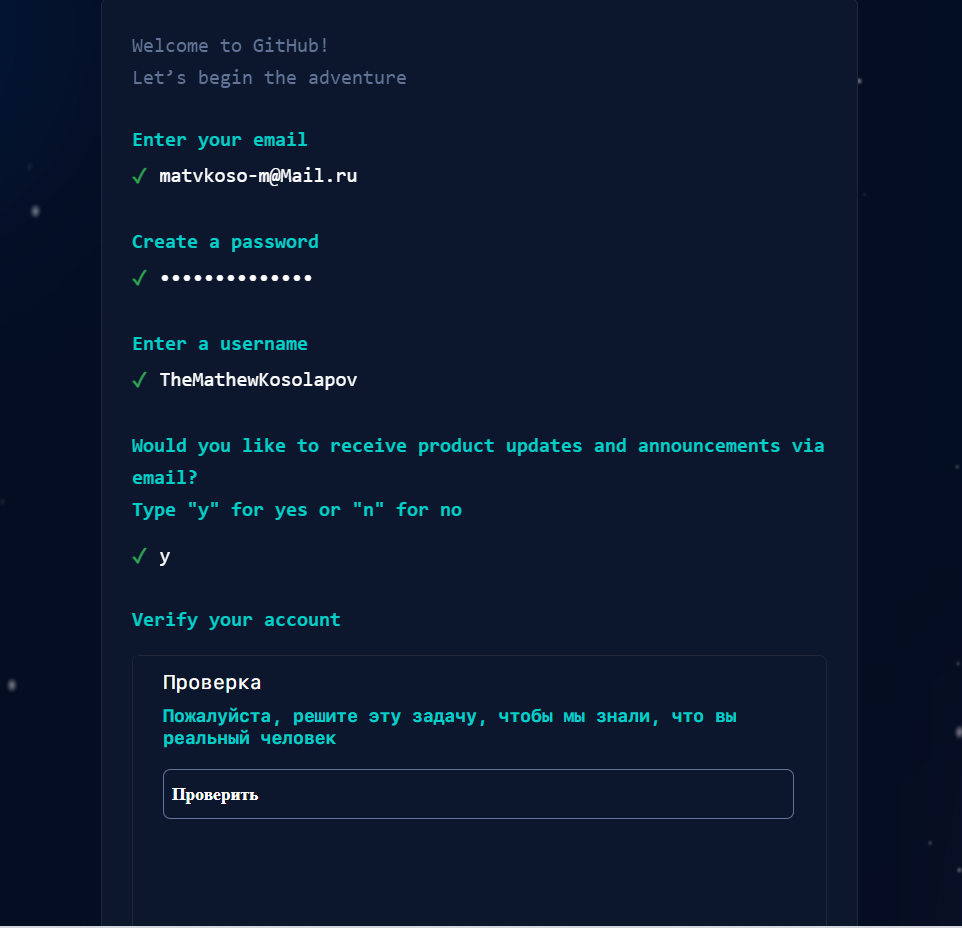{#fig:fig2 width=90%}

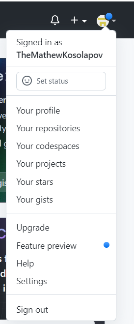{#fig:fig3 width=90%}

2. Теперь проведём предварительную конфигурацию git. Вводим эти команды,
    подставляя своё имя, фамилию и рабочую почту (рис. [-@fig:fig4] - [-@fig:fig5]):

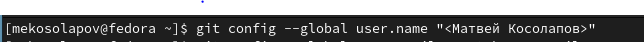{#fig:fig4 width=90%}

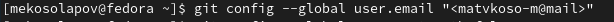{#fig:fig5 width=90%}

3. Настроим UTF-8 в выводе сообщений git (рис. [-@fig:fig6]):

{#fig:fig6 width=90%}

4. Зададим имя начальной ветки (master) (рис. [-@fig:fig7]):

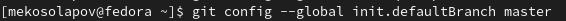{#fig:fig7 width=90%}

5. Параметр autocrlf (рис. [-@fig:fig8]):

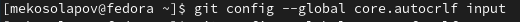{#fig:fig8 width=90%}

6. Параметр safecelf (рис. [-@fig:fig9]):

{#fig:fig9 width=90%}

7. Генерируем приватный и открытый ключи (рис. [-@fig:fig10] - [-@fig:fig11]):

{#fig:fig10 width=90%}

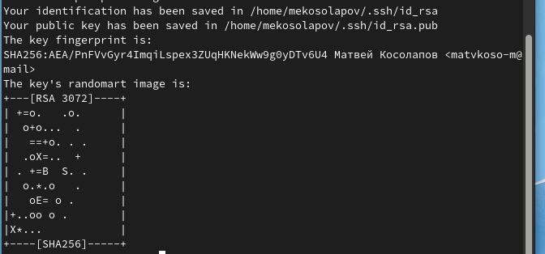{#fig:fig11 width=90%}

8. Копируем ключ (рис. [-@fig:fig12]):

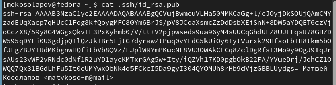{#fig:fig12 width=90%}

9. Чтобы скопировать сразу, нужно написать после команды cat ещё одну команду (рис. [-@fig:fig13]):

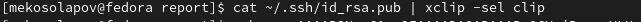{#fig:fig13 width=90%}

10. Теперь заходим на сайт и вставляем сгенерированный ключ в поле key на сайт, не
    забыв назвать (рис. [-@fig:fig14]):

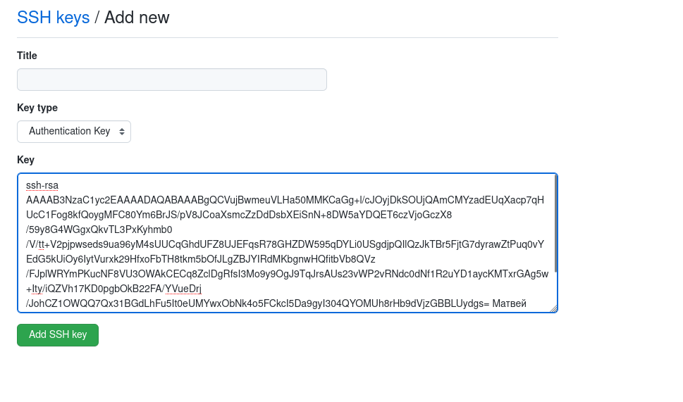{#fig:fig14 width=90%}

Всё, ключ создан и добавлен в git (рис. [-@fig:fig15]):

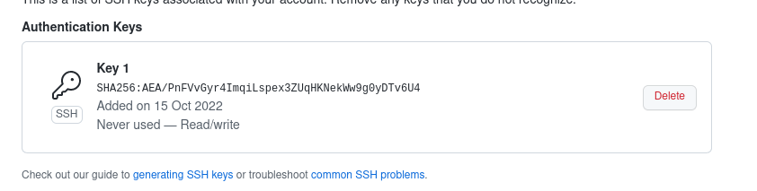{#fig:fig15 width=90%}

11. Создаём каталог для предмета Архитектура компьютера (рис. [-@fig:fig16]):

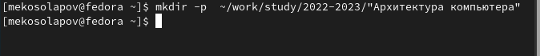{#fig:fig16 width=90%}

12. Далее переходим на страницу репозитория с шаблоном курса по ссылке (рис. [-@fig:fig17]):

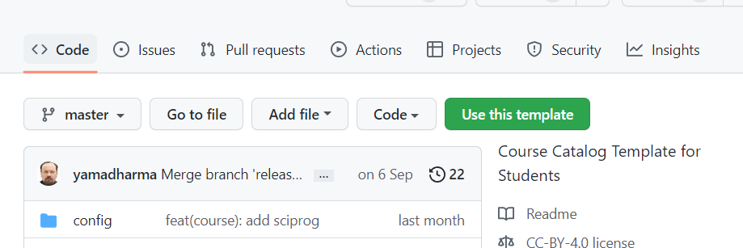{#fig:fig17 width=90%}

13. Выбираем Use this template:

В открытом окне задаём имя репозитория study_2022-2023_arh-pc и создаём его (рис. [-@fig:fig18] - [-@fig:fig19]):

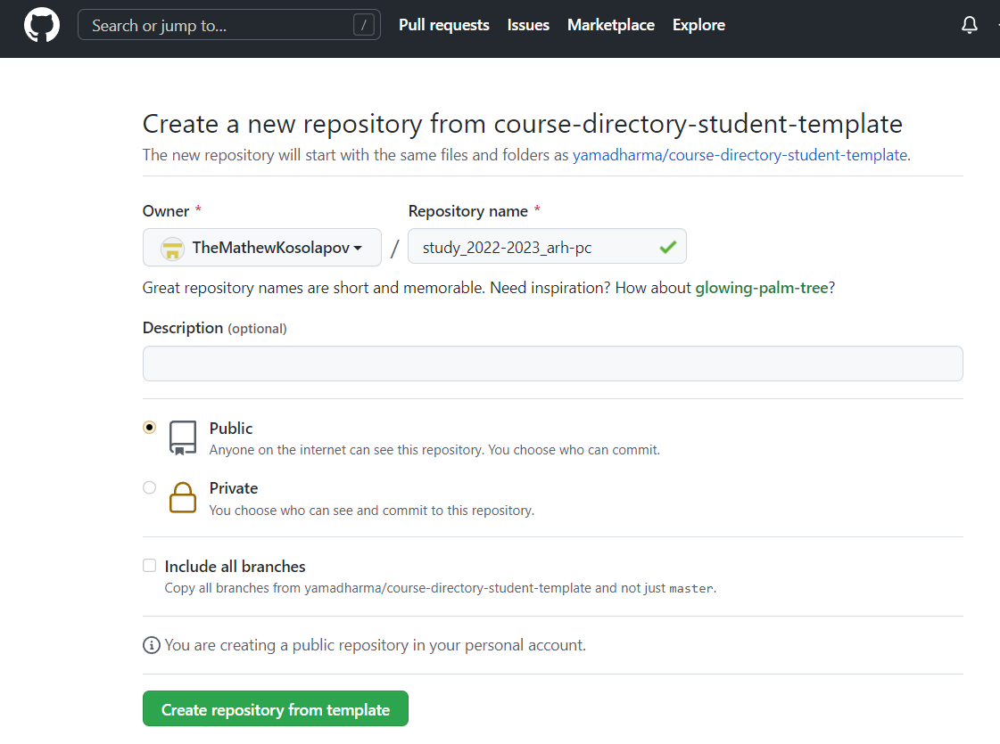{#fig:fig18 width=90%}

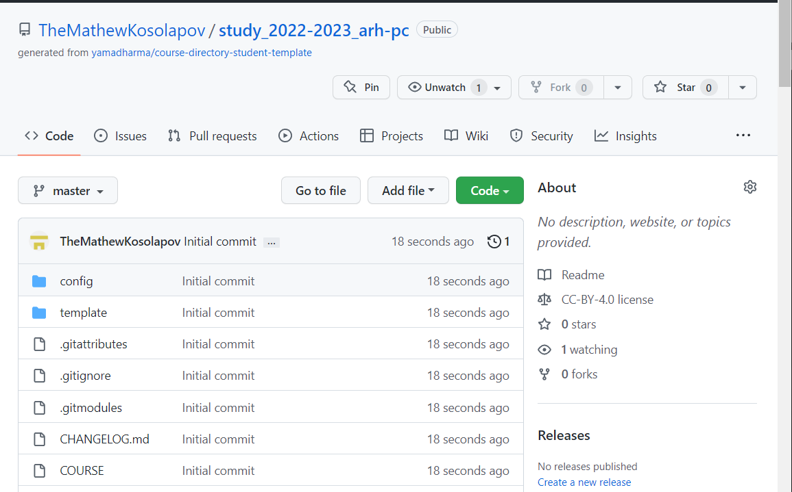{#fig:fig19 width=90%}

14. Открываем терминал и переходим в каталог курса (рис. [-@fig:fig20]):

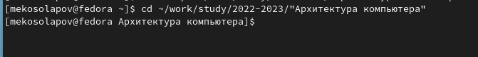{#fig:fig20 width=90%}

15. Клонируем созданный репозиторий. Но прежде ссылку для клонирования
    копируем со страницы созданного репозитория (рис. [-@fig:fig21] - [-@fig:fig22]):

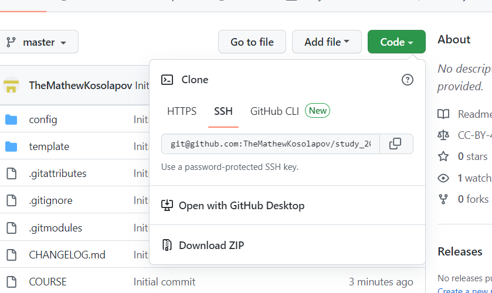{#fig:fig21 width=90%}

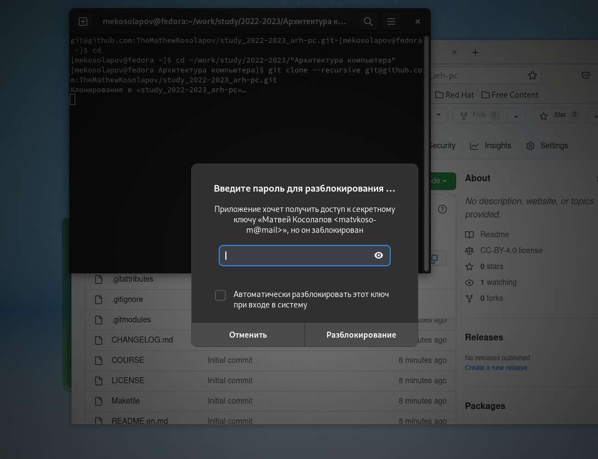{#fig:fig22 width=90%}

16. Вводим пароль ключа и заканчиваем клонирование (рис. [-@fig:fig23]):

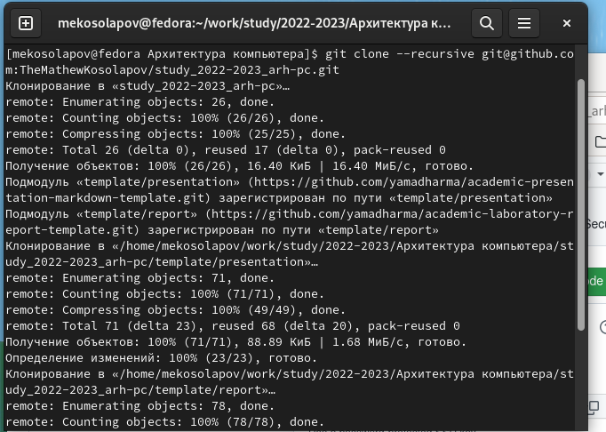{#fig:fig23 width=90%}

17. Здесь я забыл в конце команды клонирования написать новое имя каталога,
    поэтому пришлось переименовать с помощью команды mv (рис. [-@fig:fig24]):

{#fig:fig24 width=90%}

18. Переходим в каталог курса (рис. [-@fig:fig25]):

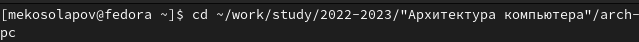{#fig:fig25 width=90%}

19. Удаляем лишние файлы с помощью команды rm (рис. [-@fig:fig26]):

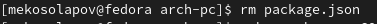{#fig:fig26 width=90%}

20. Создаём необходимые каталоги (рис. [-@fig:fig27] - [-@fig:fig28]):

{#fig:fig27 width=90%}

{#fig:fig28 width=90%}

21. Отправляем файлы на сервер (рис. [-@fig:fig29] - [-@fig:fig30]):

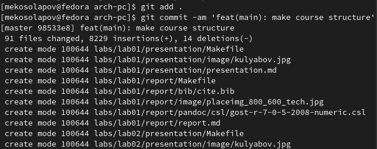{#fig:fig29 width=90%}

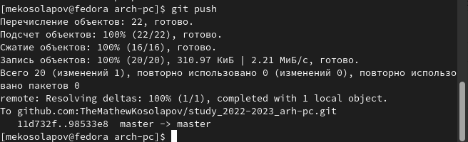{#fig:fig30 width=90%}

22. Проверяем правильность создания иерархии рабочего пространства в локальном
    репозитории и на станице github (рис. [-@fig:fig31]):

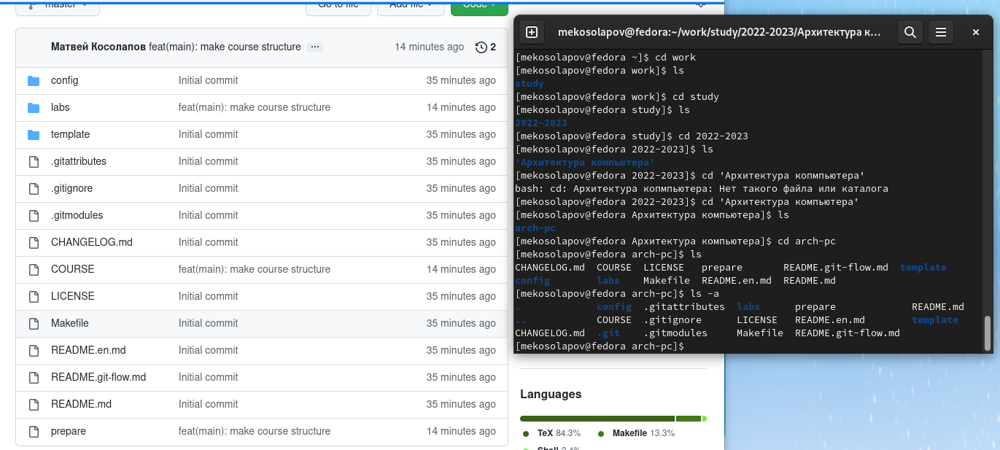{#fig:fig31 width=90%}

Всё хорошо.

# Задания для самостоятельной работы:

1. Создаём отчёт в домашней папке и переносим его в нужный подкаталог lab03 (рис. [-@fig:fig32]):

{#fig:fig32 width=90%}

2. Также делаем для первых двух отчётов, предварительно скачав их (рис. [-@fig:fig33] - [-@fig:fig34]):

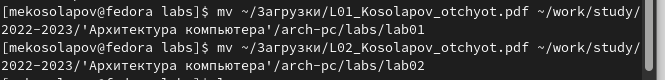{#fig:fig33 width=90%}

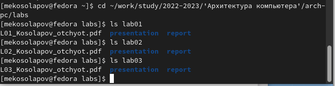{#fig:fig34 width=90%}

Отлично! Всё распределено по своим папкам. Осталось только перенести данные на
github.

3. Проверяем, какие файлы были изменены. Переносим нужные на github, не забыв
добавить пояснение о проделанных изменениях (рис. [-@fig:fig35]):

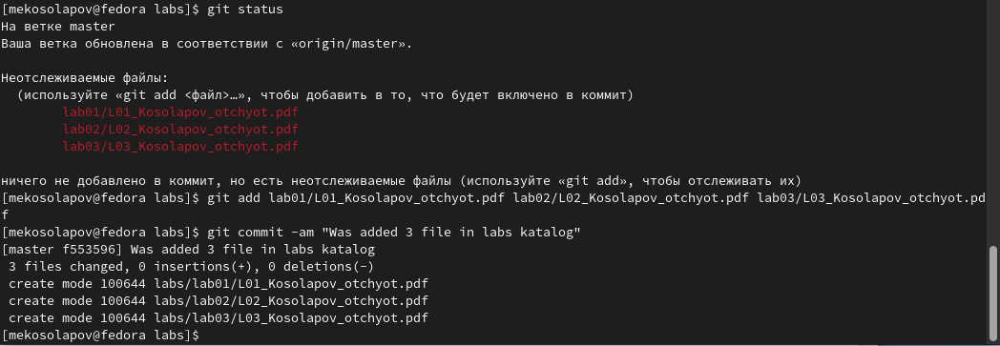{#fig:fig35 width=90%}

Всё. Файлы перенеслись успешно (рис. [-@fig:fig36] - [-@fig:fig38]):

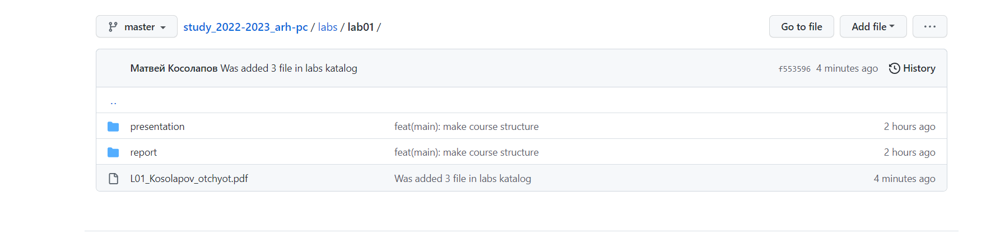{#fig:fig36 width=90%}

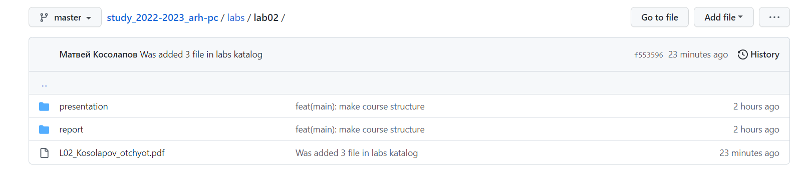{#fig:fig37 width=90%}

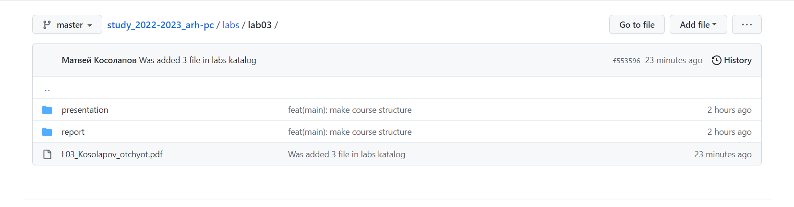{#fig:fig38 width=90%}

# Вывод:
Проделав данную лабораторную я работу, я не до конца осознал
принципы работы с git. Однако в процессе работы над данной
лабораторной работой, я научился много чему новому, так же
подкрепил и освежил свои старые знания. Нельзя не отметить, что
создание аккаунта на Github также является очень важным шагом для
меня. Так я потихоньку продвигаюсь по дороге к становлению
хорошим программистом.

# Список литературы{.unnumbered}

::: {#refs}
:::
