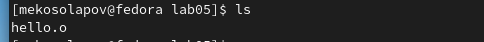

---
## Front matter
title: "Лабораторная работа №5"
subtitle: "Архитектура компьютера"
author: "Матвей Эдуардович Косолапов"

## Generic otions
lang: ru-RU
toc-title: "Содержание"

## Bibliography
bibliography: bib/cite.bib
csl: pandoc/csl/gost-r-7-0-5-2008-numeric.csl

## Pdf output format
toc: true # Table of contents
toc-depth: 2
lof: true # List of figures
lot: true # List of tables
fontsize: 12pt
linestretch: 1.5
papersize: a4
documentclass: scrreprt
## I18n polyglossia
polyglossia-lang:
  name: russian
  options:
	- spelling=modern
	- babelshorthands=true
polyglossia-otherlangs:
  name: english
## I18n babel
babel-lang: russian
babel-otherlangs: english
## Fonts
mainfont: PT Serif
romanfont: PT Serif
sansfont: PT Sans
monofont: PT Mono
mainfontoptions: Ligatures=TeX
romanfontoptions: Ligatures=TeX
sansfontoptions: Ligatures=TeX,Scale=MatchLowercase
monofontoptions: Scale=MatchLowercase,Scale=0.9
## Biblatex
biblatex: true
biblio-style: "gost-numeric"
biblatexoptions:
  - parentracker=true
  - backend=biber
  - hyperref=auto
  - language=auto
  - autolang=other*
  - citestyle=gost-numeric
## Pandoc-crossref LaTeX customization
figureTitle: "Рис."
tableTitle: "Таблица"
listingTitle: "Листинг"
lofTitle: "Список иллюстраций"
lotTitle: "Список таблиц"
lolTitle: "Листинги"
## Misc options
indent: true
header-includes:
  - \usepackage{indentfirst}
  - \usepackage{float} # keep figures where there are in the text
  - \floatplacement{figure}{H} # keep figures where there are in the text
---

# Цель работы

Освоение процедуры компиляции и сборки программ, написанных на ассемблере NASM.

# Задание

# Теоретическое введение

# Выполнение лабораторной работы

Создадим каталог для работы с программами на языке ассемблер (рис. [-@fig:fig1]):

{ #fig:fig1 width=70% }

Переходим в созданный каталог (рис. [-@fig:fig2]):

{ #fig:fig2 width=70% }

Создадим текстовый файл с именем hello.asm (рис. [-@fig:fig3]):

{ #fig:fig3 width=70% }

Открываем файл с помощью текстового редактора gedit и вводим в него данный текст программы (рис. [-@fig:fig4]):

{ #fig:fig4 width=70% }

Компилируем текст программы (рис. [-@fig:fig5]):

{ #fig:fig5 width=70% }

С помощью команды ls проверяем наличие созданного файла. Его имя hello.o (рис. [-@fig:fig6]):

{ #fig:fig6 width=70% }

Скомпилируем файл hello.asm в obj.o и проверяем, что файлы созданы  (рис. [-@fig:fig7]):

{ #fig:fig7 width=70% }

Обрабатываем объектный файл компоновщиком. С помощью команды ls проверяем, что исполняемый файл был создан (рис. [-@fig:fig8]):

{ #fig:fig8 width=70% }

После выполнения предложенной команды **ld -m elf_i386 obj.o -o main** исполняемый файл имеет имя ***main***, а начальный объектный файл называется ***obj.o*** (рис. [-@fig:fig9]):

{ #fig:fig9 width=70% }

Запускаем созданный файл через консоль (рис. [-@fig:fig10]):

{ #fig:fig10 width=70% }

Создаём копию файла hello.asm с именем lab5.asm в том же каталоге (рис. [-@fig:fig11]):

{ #fig:fig11 width=70% }

С помощью текстового редактора меняем программу lab.asm, чтобы она выводила моё имя и фамилию (рис. [-@fig:fig12]):

{ #fig:fig12 width=70% }

Превращаем файл программы lab5.asm в исполняемый файл (рис. [-@fig:fig13] - [-@fig:fig14] ):

{ #fig:fig13 width=70% }

{ #fig:fig14 width=70% }

Запускаем его (рис. [-@fig:fig15]):

{ #fig:fig15 width=70% }

Копируем получившиеся файлы в локальный репозиторий в каталог lab05 (рис. [-@fig:fig16]):

{ #fig:fig16 width=70% }

Загружаем файлы на github. Однако у меня возникла проблема с созданием файла pdf. В прошлый раз такой проблемы не было (рис. [-@fig:fig17]):

{ #fig:fig17 width=70% }

# Выводы

В ходе выполнения данной лабораторной работы я научился компилировать и собирать программы, написанные на языке ассемблере NASM. Также обновил знания и умения в работе с markdown. Снова столкнулся с небольшими проблемами и ошибками с компиляцией pdf файла.

# Список литературы{.unnumbered}

::: {#refs}
:::
