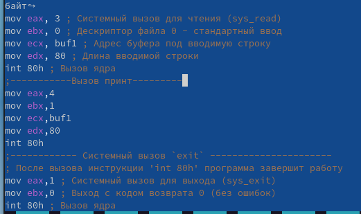
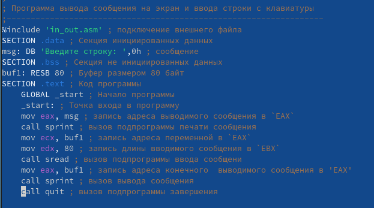
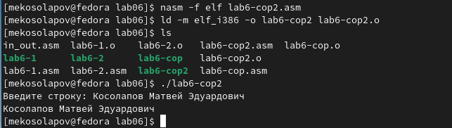

---
## Front matter
title: "Лабораторная работа №6"
subtitle: "Архитектура компьютера"
author: "Косолапов Матвей Эдуадович"

## Generic otions
lang: ru-RU
toc-title: "Содержание"

## Bibliography
bibliography: bib/cite.bib
csl: pandoc/csl/gost-r-7-0-5-2008-numeric.csl

## Pdf output format
toc: true # Table of contents
toc-depth: 2
lof: true # List of figures
lot: true # List of tables
fontsize: 12pt
linestretch: 1.5
papersize: a4
documentclass: scrreprt
## I18n polyglossia
polyglossia-lang:
  name: russian
  options:
	- spelling=modern
	- babelshorthands=true
polyglossia-otherlangs:
  name: english
## I18n babel
babel-lang: russian
babel-otherlangs: english
## Fonts
mainfont: PT Serif
romanfont: PT Serif
sansfont: PT Sans
monofont: PT Mono
mainfontoptions: Ligatures=TeX
romanfontoptions: Ligatures=TeX
sansfontoptions: Ligatures=TeX,Scale=MatchLowercase
monofontoptions: Scale=MatchLowercase,Scale=0.9
## Biblatex
biblatex: true
biblio-style: "gost-numeric"
biblatexoptions:
  - parentracker=true
  - backend=biber
  - hyperref=auto
  - language=auto
  - autolang=other*
  - citestyle=gost-numeric
## Pandoc-crossref LaTeX customization
figureTitle: "Рис."
tableTitle: "Таблица"
listingTitle: "Листинг"
lofTitle: "Список иллюстраций"
lotTitle: "Список таблиц"
lolTitle: "Листинги"
## Misc options
indent: true
header-includes:
  - \usepackage{indentfirst}
  - \usepackage{float} # keep figures where there are in the text
  - \floatplacement{figure}{H} # keep figures where there are in the text
---

# Цель работы

Приобретение практических навыков работы в Midnight Commander. Освоение
инструкций языка ассемблера mov и int.

# Задание

# Теоретическое введение

# Выполнение лабораторной работы

1. Откроем Midnight Commander (рис. [-@fig:fig01]):

{ #fig:fig01 width=70% }

2. Переходим в каталог ~/work/arch-pc (рис. [-@fig:fig02]):

{ #fig:fig02 width=70% }

3. Создаём папку lab06 и переходим в неё (рис. [-@fig:fig03] - рис. [-@fig:fig04]):

{ #fig:fig03 width=70% }

{ #fig:fig04 width=70% }

4. Создаём файл lab6-1.asm (рис. [-@fig:fig05]):

{ #fig:fig05 width=70% }

5. Открываем созданный файл, вводим в него предложенную программу, сохраняем и закрываем (рис. [-@fig:fig06]):

{ #fig:fig06 width=70% }

6. Откроем файл и проверим, что файл содержит текст программы (рис. [-@fig:fig07]):

{ #fig:fig07 width=70% }

7. Переводим текст программы в исполняемый файл.  Запускаем файл и вводим своё ФИО (рис. [-@fig:fig08])

{ #fig:fig08 width=70% }

9. Скачиваем файл in_out.asm , переносим файл в каталог с программой (рис. [-@fig:fig09])

{ #fig:fig09 width=70% }

10. Создаём копию файла lab6-1.asm с именем lab6-2.asm (рис. [-@fig:fig10])

{ #fig:fig10 width=70% }

11. Меняем текст программы для использования подпрограмм из внешнего файла in_out.asm (рис. [-@fig:fig11]):

{ #fig:fig11 width=70% }

12. Создаём исполняемый файл и проверяем его работу (рис. [-@fig:fig12]):

{ #fig:fig12 width=70% }

13. Меняем подпрограмму sprintLF на sprint в тексте программы, смотрим результат. (рис. [-@fig:fig13]):

{ #fig:fig13 width=70% }

Разница в том, что с sprintLF ввод данных осуществляется на новой строке, а в sprint на той же. 

14. Создаём копию файла lab6-1.asm с имене lab6-cop.asm, меняем его, чтобы он выводил ввёденные данные (рис. [-@fig:fig14]):

{ #fig:fig14 width=70% }

15. Создаём исполнительный файл и проверяем его работу (рис. [-@fig:fig15]):

{ #fig:fig15 width=70% }

16. Создаём копию файла lab6-2.asm с имене lab6-cop2.asm, меняем его, чтобы он выводил ввёденные данные (рис. [-@fig:fig16]):

{ #fig:fig16 width=70% }

17. Создаём исполнительный файл и проверяем его работу (рис. [-@fig:fig17]):

{ #fig:fig17 width=70% }

18. Отлично! Всё работает прекрасно!

# Выводы

В ходе данной лабораторной работы я научился писать программы в Midnight Commander.

# Список литературы{.unnumbered}

::: {#refs}
:::
