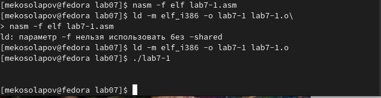
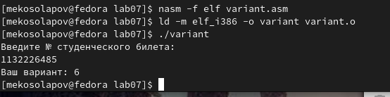

---
## Front matter
title: "Лабораторная работа №7"
subtitle: "Архитектура компьютера"
author: "Матвей Эдуардович Косолапов"

## Generic otions
lang: ru-RU
toc-title: "Содержание"

## Bibliography
bibliography: bib/cite.bib
csl: pandoc/csl/gost-r-7-0-5-2008-numeric.csl

## Pdf output format
toc: true # Table of contents
toc-depth: 2
lof: true # List of figures
lot: true # List of tables
fontsize: 12pt
linestretch: 1.5
papersize: a4
documentclass: scrreprt
## I18n polyglossia
polyglossia-lang:
  name: russian
  options:
	- spelling=modern
	- babelshorthands=true
polyglossia-otherlangs:
  name: english
## I18n babel
babel-lang: russian
babel-otherlangs: english
## Fonts
mainfont: PT Serif
romanfont: PT Serif
sansfont: PT Sans
monofont: PT Mono
mainfontoptions: Ligatures=TeX
romanfontoptions: Ligatures=TeX
sansfontoptions: Ligatures=TeX,Scale=MatchLowercase
monofontoptions: Scale=MatchLowercase,Scale=0.9
## Biblatex
biblatex: true
biblio-style: "gost-numeric"
biblatexoptions:
  - parentracker=true
  - backend=biber
  - hyperref=auto
  - language=auto
  - autolang=other*
  - citestyle=gost-numeric
## Pandoc-crossref LaTeX customization
figureTitle: "Рис."
tableTitle: "Таблица"
listingTitle: "Листинг"
lofTitle: "Список иллюстраций"
lotTitle: "Список таблиц"
lolTitle: "Листинги"
## Misc options
indent: true
header-includes:
  - \usepackage{indentfirst}
  - \usepackage{float} # keep figures where there are in the text
  - \floatplacement{figure}{H} # keep figures where there are in the text
---

# Цель работы

Освоение арифметических инструкций языка ассемблера NASM.

# Задание

# Теоретическое введение

# Выполнение лабораторной работы
1. Создадим каталог для программ ~/work/arch-pc/lab07, переходим в него и создаём файл lab7-1.asm (рис. [-@fig:fig001]):

{ #fig:fig001 width=70% }

2. Переносим в файл предложенную программу (рис. [-@fig:fig002]):

{ #fig:fig002 width=70% }

3. Создаём и запускаем исполняемый файл (рис. [-@fig:fig003]):

{ #fig:fig003 width=70% }

4. Изменяем программу, меняя '6','4' на 6,4 (рис. [-@fig:fig004]):

{ #fig:fig004 width=70% }

5. Создаём и запускаем исполняемый файл. Получаем символ пустоты (рис. [-@fig:fig005]):

{ #fig:fig005 width=70% }

6. Создаём файл lab7-2.asm и вводим в него текст предложенной программы (рис. [-@fig:fig006]):

{ #fig:fig006 width=70% }

7. Создаём исполняемый файл и запускаем его (рис. [-@fig:fig007]):

{ #fig:fig007 width=70% }

8. Изменяем программу, меняя '6','4' на 6,4 (рис. [-@fig:fig008]):

{ #fig:fig008 width=70% }

9. Создаём исполняемый файл и запускаем его. В результате выведено число 10 (рис. [-@fig:fig009]):

{ #fig:fig009 width=70% }

10. Меняем функцию iprintLF на iprint, создаём исполняемый файл и проверяем его работу. Видим, что функция iprintLF добавляет в конце снос строки (рис. [-@fig:fig010] - рис. [-@fig:fig011]):

{ #fig:fig010 width=70% }

{ #fig:fig011 width=70% }

11. Создаём файл в этом же каталоге файл lab7-3.asm (рис. [-@fig:fig012]):

{ #fig:fig012 width=70% }

12. Переносим в файл программу вычисления значения функции (рис. [-@fig:fig013]):

{ #fig:fig013 width=70% }

13. Создаём исполняемый файл и запускаем его (рис. [-@fig:fig014]):

{ #fig:fig014 width=70% }

14. Меняем программу под новую функцию. Создаём исполняемый файл и запускаем его (рис. [-@fig:fig015] - рис. [-@fig:fig016]):

{ #fig:fig015 width=70% }

{ #fig:fig016 width=70% }

15. Теперь создадим файл variant.asm для определения варианта задания (рис. [-@fig:fig017]):

{ #fig:fig017 width=70% }

16. Переносим текст предложенной программы в файл, создаём исполняемый файл и проверяем его работу (рис. [-@fig:fig018]- рис. [-@fig:fig019]):

{ #fig:fig018 width=70% }

{ #fig:fig019 width=70% }

17. Ответы на вопросы:
    1. За вывод сообщения:'Ваш вариант: ' отвечают строки, не считая строки, в которой задаётся сообщение:
*"mov eax,rem"*, *"call sprint"*
    2. *"nasm"* - создание объектного файла, *"mov ecx,x"* - помещение в *ecx* значения *x* ,*"mov edx,80"* - помещение в *edx* значения *80*, *"call spread"* - считывание введённых данных
    3. *"call atoi"* используется для преобразования ASCII символов в числа.
    4. За вычисления варианта отвечают строки:*"xor edx,edx"*, *"mov ebx,20"*, *"div ebx"*, *"inc edx"*
    5. Остаток от деления при выполнении инструкции *"div ebx"* записывается в *edx*
    6. Инструкция *"inc edx"* используется для прибавления *1* к *edx*
    7. За вывод на экран результата вычислений отвечают строки: *"mov eax,edx"*, *"call iprintLF"*
    

***Задания для самостоятельной работы***

18. Так как у меня 6 вариант, то делаем программу для 6 уравнения (рис. [-@fig:fig020] - рис. [-@fig:fig021]):

{ #fig:fig020 width=70% }

{ #fig:fig021 width=70% }

19. Создаём исполняемый файл и проверяем его работу на числах 2, 5, 3 (рис. [-@fig:fig022]):

{ #fig:fig022 width=70% }

Отлично! Всё работает

# Выводы

В ходе данной работы я научился писать программы на assembler

# Список литературы{.unnumbered}

::: {#refs}
:::
