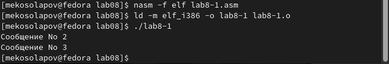

---
## Front matter
title: "Лабораторная работа №8"
subtitle: "Архитектура компьютера"
author: "Косолапов Матвей Эдуардович"

## Generic otions
lang: ru-RU
toc-title: "Содержание"

## Bibliography
bibliography: bib/cite.bib
csl: pandoc/csl/gost-r-7-0-5-2008-numeric.csl

## Pdf output format
toc: true # Table of contents
toc-depth: 2
lof: true # List of figures
lot: true # List of tables
fontsize: 12pt
linestretch: 1.5
papersize: a4
documentclass: scrreprt
## I18n polyglossia
polyglossia-lang:
  name: russian
  options:
	- spelling=modern
	- babelshorthands=true
polyglossia-otherlangs:
  name: english
## I18n babel
babel-lang: russian
babel-otherlangs: english
## Fonts
mainfont: PT Serif
romanfont: PT Serif
sansfont: PT Sans
monofont: PT Mono
mainfontoptions: Ligatures=TeX
romanfontoptions: Ligatures=TeX
sansfontoptions: Ligatures=TeX,Scale=MatchLowercase
monofontoptions: Scale=MatchLowercase,Scale=0.9
## Biblatex
biblatex: true
biblio-style: "gost-numeric"
biblatexoptions:
  - parentracker=true
  - backend=biber
  - hyperref=auto
  - language=auto
  - autolang=other*
  - citestyle=gost-numeric
## Pandoc-crossref LaTeX customization
figureTitle: "Рис."
tableTitle: "Таблица"
listingTitle: "Листинг"
lofTitle: "Список иллюстраций"
lotTitle: "Список таблиц"
lolTitle: "Листинги"
## Misc options
indent: true
header-includes:
  - \usepackage{indentfirst}
  - \usepackage{float} # keep figures where there are in the text
  - \floatplacement{figure}{H} # keep figures where there are in the text
---

# Цель работы

Изучить команды условного и безусловного перехода, приобрести навыки написания программ с использованием перехода, познакомиться с назначением и структурой файла листинга.

# Выполнение лабораторной работы

1. Создаем каталог для программ лабораторной работы №8, переходим в него и создаем файл lab8-1.asm (рис. [-@fig:001]):

{ #fig:001 width=70% }

2. Вводим в файл lab8-1.asm текст предложенной программы (рис. [-@fig:002]):

{ #fig:002 width=70% }

3. Создаем исполняемый файл и запускаем его(рис. [-@fig:003]):

{ #fig:003 width=70% }

4. Далее в текст программы после вывода сообщения №2 добавим инструкцию jmp с меткой _label1 и после вывода сообщения №1 добавим инструкцию jmp с меткой _end. Изменим текст программы в соответствии с листингом 8.2 (рис. [-@fig:004]):

{ #fig:004 width=70% }

5. Создаем исполняемый файл и проверяем его работу (рис. [-@fig:005]):

{ #fig:005 width=70% }

6. Изменим текст программы, добавив и изменив инструкцию jmp, чтобы сообщения выводились с 3-го по 1-ый (рис. [-@fig:006]):

{ #fig:006 width=70% }

7. Создаем исполняемый файл и проверяем его работу (рис. [-@fig:007]):

{ #fig:007 width=70% }

8. Создаем файл lab8-2.asm, вводим в него текст программы из листинга 8.3 (рис. [-@fig:008]):

{ #fig:008 width=70% }

9. Создаем исполняемый файл и проверяем его (рис. [-@fig:009]):

{ #fig:009 width=70% }

10. Далее создаем файл листинга для программы из файла lab8-2.asm.(рис. [-@fig:010]):

{ #fig:010 width=70% }

11. Открываем файл листинга с помощью текстового редактора gedit. В строках 24, 25, 28 мы видим последовательно идущие номер строки, смещение машинного кода от начала текущего сегмента, машинный код(инструкции, используемые для разных целей), исходный текст программы(рис. [-@fig:011]):

{ #fig:011 width=70% }

12. Открываем файл с программой lab8-2.asm и на 14 строке удаляем операнд(рис. [-@fig:012] - рис. [-@fig:013]):

{ #fig:012 width=70% }

{ #fig:013 width=70% }

13. Создаём файл листинга, получаем сообщение об ошибке, заходим в созданный файл и видим ошибку(рис. [-@fig:014] - рис. [-@fig:015]):

{ #fig:014 width=70% }

{ #fig:015 width=70% }

***ЗАДАНИЯ ДЛЯ САМОСТОЯТЕЛЬНОЙ РАБОТЫ***

14. Пишем программу №1 для нахождения наименьшего числа среди чисел 79, 83, 41(6 вариант)(рис. [-@fig:017]):

{ #fig:017 width=70% }

15. Создание исполняемого файла и проверка работы(рис. [-@fig:018]):

{ #fig:018 width=70% }

16. Пишем программу №2 по 6 варианту с предложенным условием(рис. [-@fig:019]):

{ #fig:019 width=70% }

17. Создание исполняемого файла и проверка работы(рис. [-@fig:020]):

{ #fig:020 width=70% }

# Выводы

В ходе данной лабораторной работы я изучил команды условного и безусловного перехода, приобрел навыки написания программ с использованием перехода, познакомился с назначением и структурой файла листинга.

# Список литературы{.unnumbered}

::: {#refs}
:::
