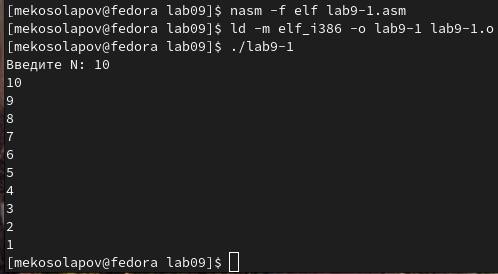

---
## Front matter
title: "Лабораторная работа №9"
subtitle: "Архитектура компьютера"
author: "Косолапов Матвей Эдуадович"

## Generic otions
lang: ru-RU
toc-title: "Содержание"

## Bibliography
bibliography: bib/cite.bib
csl: pandoc/csl/gost-r-7-0-5-2008-numeric.csl

## Pdf output format
toc: true # Table of contents
toc-depth: 2
lof: true # List of figures
lot: true # List of tables
fontsize: 12pt
linestretch: 1.5
papersize: a4
documentclass: scrreprt
## I18n polyglossia
polyglossia-lang:
  name: russian
  options:
	- spelling=modern
	- babelshorthands=true
polyglossia-otherlangs:
  name: english
## I18n babel
babel-lang: russian
babel-otherlangs: english
## Fonts
mainfont: PT Serif
romanfont: PT Serif
sansfont: PT Sans
monofont: PT Mono
mainfontoptions: Ligatures=TeX
romanfontoptions: Ligatures=TeX
sansfontoptions: Ligatures=TeX,Scale=MatchLowercase
monofontoptions: Scale=MatchLowercase,Scale=0.9
## Biblatex
biblatex: true
biblio-style: "gost-numeric"
biblatexoptions:
  - parentracker=true
  - backend=biber
  - hyperref=auto
  - language=auto
  - autolang=other*
  - citestyle=gost-numeric
## Pandoc-crossref LaTeX customization
figureTitle: "Рис."
tableTitle: "Таблица"
listingTitle: "Листинг"
lofTitle: "Список иллюстраций"
lotTitle: "Список таблиц"
lolTitle: "Листинги"
## Misc options
indent: true
header-includes:
  - \usepackage{indentfirst}
  - \usepackage{float} # keep figures where there are in the text
  - \floatplacement{figure}{H} # keep figures where there are in the text
---

# Цель работы

Приобретение навыков написания программ с использованием циклов и
обработкой аргументов командной строки.

# Задание

# Теоретическое введение

# Выполнение лабораторной работы

1. Cоздаём каталог lab09, в нём создаём файл lab9-1.asm(рис. [-@fig:fig01]):

{ #fig:fig01 width=70% }

2. Переносим в файл программу из листинга №1(рис. [-@fig:fig02]):

{ #fig:fig02 width=70% }

3. Создаём исполняемый файл, проверяем работу. Выводится 10 цифр [от 10 до 0], как и было введено(рис. [-@fig:fig03]):

{ #fig:fig03 width=70% }

4. Меняем программу, добавляя команду **sub ecx, [N]** (рис. [-@fig:fig04]):

{ #fig:fig04 width=70% }

5. Проверяем работу программы. Теперь нам выводятся нечётные числа от 0 до 10(5 чисел)(рис. [-@fig:fig05]):

{ #fig:fig05 width=70% }

6. Снова меняем программу, добавляя команду **push ecx** (рис. [-@fig:fig06]):

{ #fig:fig06 width=70% }

7.  Проверяем работу программы. Теперь нам выводятся числа [от 9 до 0](10 чисел) (рис. [-@fig:fig07])

{ #fig:fig07 width=70% }

8. Создаём файл lab9-2.asm и переносим предложенную программу из листинга №2 (рис. [-@fig:fig08])

{ #fig:fig08 width=70% }

9. Создаём исполняемый файл и проверяем работу. Выводятся все введённые аргументы (рис. [-@fig:fig09])

{ #fig:fig09 width=70% }

10. Создаём файл lab9-3.asm и переносим предложенную программу из листинга №3, которая суммирует все аргументы(рис. [-@fig:fig10]):

{ #fig:fig10 width=70% }

11. Создаём исполняемый файл и проверяем его работу (рис. [-@fig:fig11]):

{ #fig:fig11 width=70% }

12. Меняем программу так, чтобы она выводил произведение аргументов(рис. [-@fig:fig12]):

{ #fig:fig12 width=70% }

13. Создаём исполняемый файл и проверяем работу программы (рис. [-@fig:fig13]):

{ #fig:fig13 width=70% }

***Задания для самостоятельной работ***
14. Программа, суммирующая f(x) для множества x-ов (рис. [-@fig:fig14]):

{ #fig:fig14 width=70% }

15. Создаём исполняемый файл и проверяем его работу (рис. [-@fig:fig15]):

{ #fig:fig15 width=70% }

# Выводы

В ходе данной лабораторной работы я научился работать с циклами и использовать их для вычисления различных функций. Мне понравилось, так как я уже могу написать какую-то простую программу для вычисления чего-либо. Например, факториала.

# Список литературы{.unnumbered}

::: {#refs}
:::
