---
## Front matter
title: "Лабораторная работа №10"
subtitle: "Архитектура компьютера"
author: "Косолапов Матвей Эдуадович"

## Generic otions
lang: ru-RU
toc-title: "Содержание"

## Bibliography
bibliography: bib/cite.bib
csl: pandoc/csl/gost-r-7-0-5-2008-numeric.csl

## Pdf output format
toc: true # Table of contents
toc-depth: 2
lof: true # List of figures
lot: true # List of tables
fontsize: 12pt
linestretch: 1.5
papersize: a4
documentclass: scrreprt
## I18n polyglossia
polyglossia-lang:
  name: russian
  options:
	- spelling=modern
	- babelshorthands=true
polyglossia-otherlangs:
  name: english
## I18n babel
babel-lang: russian
babel-otherlangs: english
## Fonts
mainfont: PT Serif
romanfont: PT Serif
sansfont: PT Sans
monofont: PT Mono
mainfontoptions: Ligatures=TeX
romanfontoptions: Ligatures=TeX
sansfontoptions: Ligatures=TeX,Scale=MatchLowercase
monofontoptions: Scale=MatchLowercase,Scale=0.9
## Biblatex
biblatex: true
biblio-style: "gost-numeric"
biblatexoptions:
  - parentracker=true
  - backend=biber
  - hyperref=auto
  - language=auto
  - autolang=other*
  - citestyle=gost-numeric
## Pandoc-crossref LaTeX customization
figureTitle: "Рис."
tableTitle: "Таблица"
listingTitle: "Листинг"
lofTitle: "Список иллюстраций"
lotTitle: "Список таблиц"
lolTitle: "Листинги"
## Misc options
indent: true
header-includes:
  - \usepackage{indentfirst}
  - \usepackage{float} # keep figures where there are in the text
  - \floatplacement{figure}{H} # keep figures where there are in the text
---

# Цель работы

Приобретение навыков написания программ с использованием подпрограмм.
Знакомство с методами отладки при помощи GDB и его основными возможно-
стями.

# Задание

# Теоретическое введение

# Выполнение лабораторной работы

1. Cоздаём каталог lab10, в нём создаём файл lab10-1.asm(рис. [-@fig:fig01]):

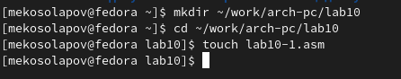{ #fig:fig01 width=70% }

2. Переносим в файл программу вычисления функции из листинга №1(рис. [-@fig:fig02]):

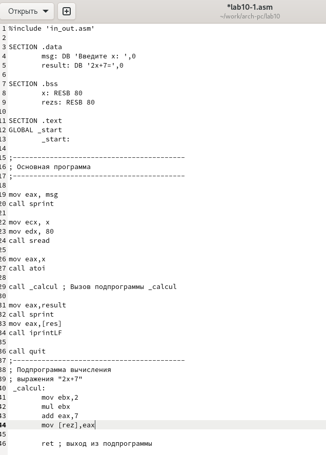{ #fig:fig02 width=70% }

3. Создаём исполняемый файл, проверяем работу. Видим ошибку из-за неправильного названия переменных (res,rez,resz).(рис. [-@fig:fig03]):

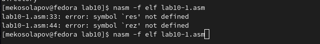{ #fig:fig03 width=70% }

4. Исправляем код программы(рис. [-@fig:fig04]):

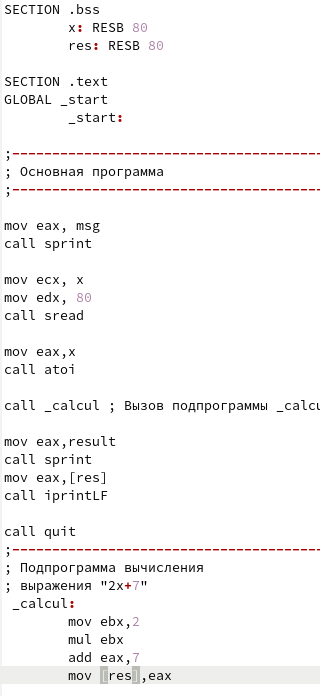{ #fig:fig04 width=70% }

5. Создаём исполняемый файл, проверяем работу(рис. [-@fig:fig05]):

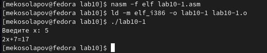{ #fig:fig05 width=70% }

6. Снова меняем программу, добавляя подпрограмму *_subcalcul*, тоже вычисляющую функцию(рис. [-@fig:fig06]):

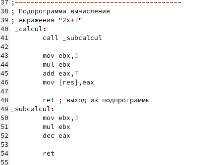{ #fig:fig06 width=70% }

7. Создаём исполняемый файл, проверяем работу(рис. [-@fig:fig07])

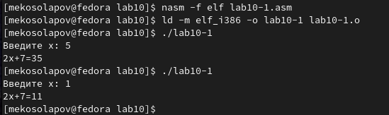{ #fig:fig07 width=70% }

8. Создаём файл lab10-2.asm и переносим предложенную программу из листинга №2 (рис. [-@fig:fig08])

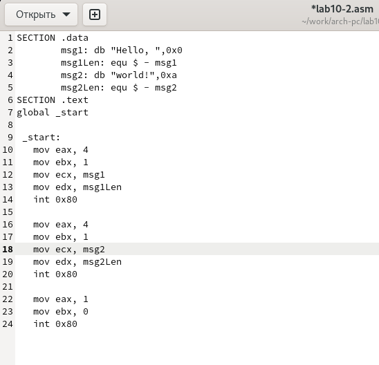{ #fig:fig08 width=70% }

9. Создаём исполняемый файл и файл листинга с ключом -g. Загружаем исполняемый файл в отладчик GDB(рис. [-@fig:fig09])

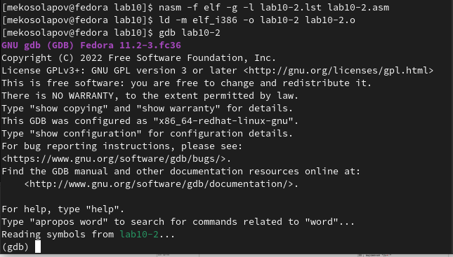{ #fig:fig09 width=70% }

10. Запускаем программу в оболочке GDB с помощью команды *run*(рис. [-@fig:fig10]):

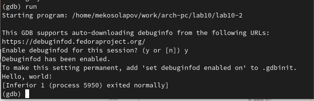{ #fig:fig10 width=70% }

11. Устанавливаем брейкпоинт на метку _start. Запускаем программу (рис. [-@fig:fig11]):

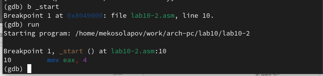{ #fig:fig11 width=70% }

12. Смотрим дисассимилированный код программы с помощью команды *disassemble* начиная с метки _start (рис. [-@fig:fig12]):

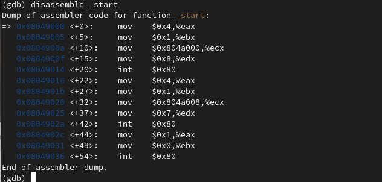{ #fig:fig12 width=70% }

13. Переключаемся на Intel'овский синтаксис с помощью команды *set disassebly-flavor intel*. Снова смотрим дисассимилированный код. Видно что в режиме ATT сначала идут переменные, после основные регистры. А в режиме Intel наоборот (рис. [-@fig:fig13]):

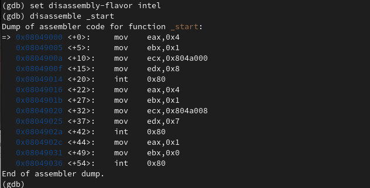{ #fig:fig13 width=70% }

14. Включаем режим псевдографики(рис. [-@fig:fig14]):

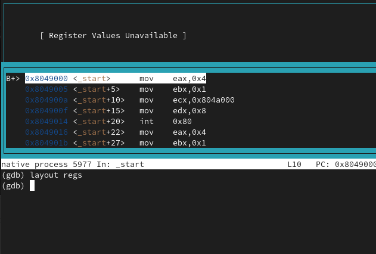{ #fig:fig14 width=70% }

15. Проверяем, установлена ли точка останова с помощью команды *i b* (рис. [-@fig:fig15]):

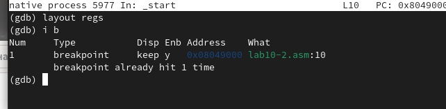{ #fig:fig15 width=70% }

16. Устанавливаем ещё одну точку останова по адресу инструкции mov eax,0x0. Смотрим все установленный breakpoints(рис. [-@fig:fig16]):

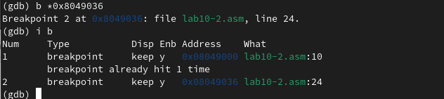{ #fig:fig16 width=70% }

17. Смотрим содержание регистров с помощью команды *i r* (рис. [-@fig:fig17]):

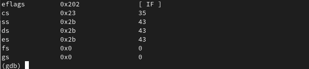{ #fig:fig17 width=70% }

18. Смотрим содержание регистров после выполнения 5 инструкций с помощью команды *si 5*. Видим, что изменились некоторые регистры. (рис. [-@fig:fig18]):

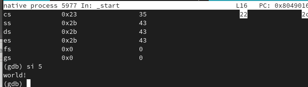{ #fig:fig18 width=70% }

19. Смотрим значение переменной msg1 по имени (рис. [-@fig:fig19]):

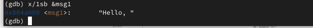{ #fig:fig19 width=70% }

20. Смотрим значение переменной msg2 по адресу(рис. [-@fig:fig20]):

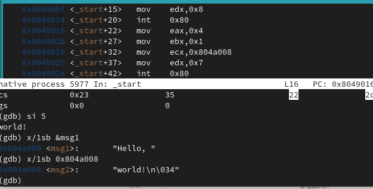{ #fig:fig20 width=70% }

21. Изменяем первый символ переменной msg1 с помощью команды *set*. Смотрим получившийся результат (рис. [-@fig:fig21]):

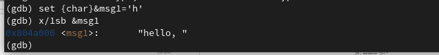{ #fig:fig21 width=70% }

22. Так же меняем первый символ переменной msg2. Смотрим результат (рис. [-@fig:fig22])

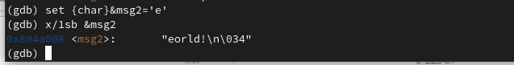{ #fig:fig22 width=70% }

23. Выводим в шестнадцатеричном, в двоичном, в символьном форматах значение регистра edx (рис. [-@fig:fig23])

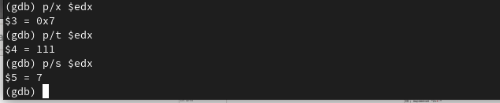{ #fig:fig23 width=70% }

24. Изменяем значение регистра ebx на '2' с помощью команды *set* (рис. [-@fig:fig24])

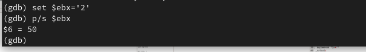{ #fig:fig24 width=70% }

25. Изменяем значение регистра ebx на 2 с помощью команды *set*. Видим, что выводимый результат отличается. Это потому, что в первом случае мы помещаем в регистр строку '2', а во втором число 2(рис. [-@fig:fig25]):

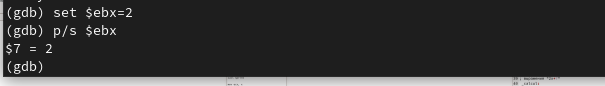{ #fig:fig25 width=70% }

26. Завершаем выполнение программы с помощью команды *c* (рис. [-@fig:fig26]):

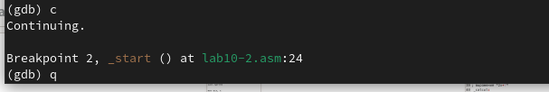{ #fig:fig26 width=70% }

27. Копируем файл lab9-2.asm в файл с именем lab10-3.asm (рис. [-@fig:fig27]):

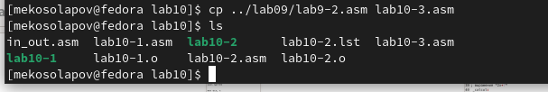{ #fig:fig27 width=70% }

28. Создаём исполняемый файл и файл листинга с ключом -g (рис. [-@fig:fig28]):

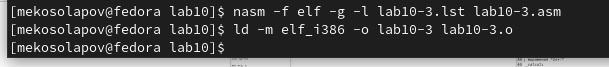{ #fig:fig28 width=70% }

29. Загружаем исполняемый файл в отладчик GDB, указывая аргументы (рис. [-@fig:fig29]):

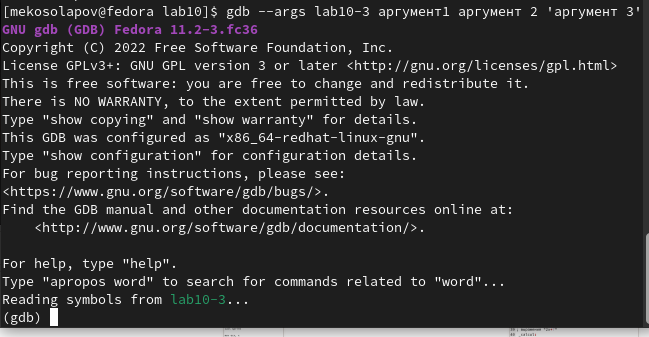{ #fig:fig29 width=70% }

30. Устанавливаем точку останова перед _start и запускаем программу(рис. [-@fig:fig30]):

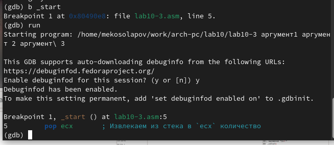{ #fig:fig30 width=70% }

31. Узнаём количеству аргументов командной строки (рис. [-@fig:fig31]):

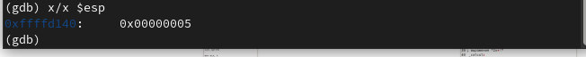{ #fig:fig31 width=70% }

32. Смотрим позиции стека по адресам [esp+4n], n={1,2,3,4,5,6}. Шаг равен 4, потому что на каждый аргумент выделено 4 байта (рис. [-@fig:fig32]):

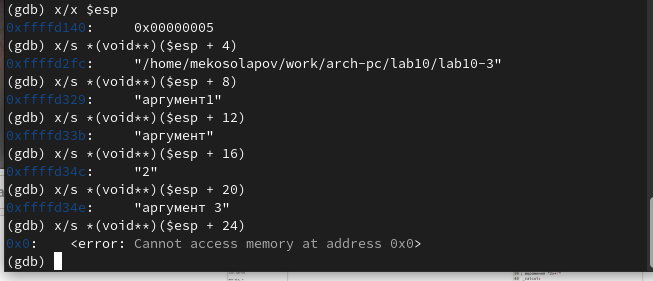{ #fig:fig32 width=70% }

***Задания для самостоятельной работ***
33. Скопируем программу из лабораторной работы №9 и реализуем в ней
вычисление функции через подпрограмму (рис. [-@fig:fig33]):

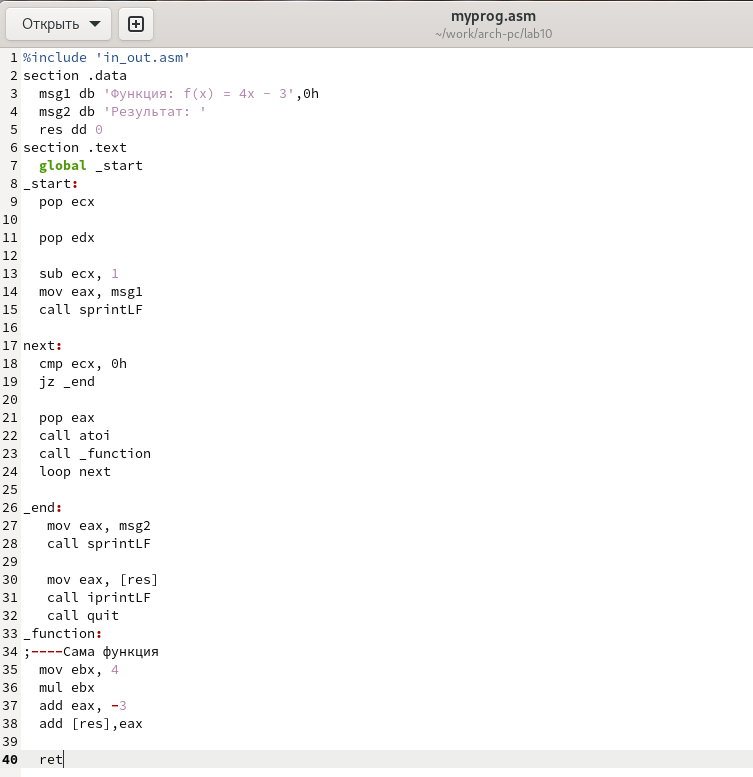{ #fig:fig33 width=70% }

34. Создаём исполняемый файл и проверяем его работу (рис. [-@fig:fig34]):

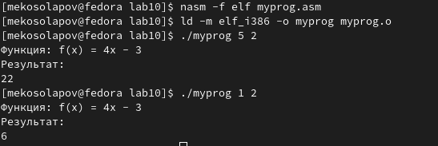{ #fig:fig34 width=70% }

35. Теперь найдём ошибку в предложенной программе и исправим её. С помощью gdb отслеживаем работу программы. Исправляем программу для вычисления умножения, поменяв регистры местами (сначала eax умножался на 4, а не ebx) (рис. [-@fig:fig35]):

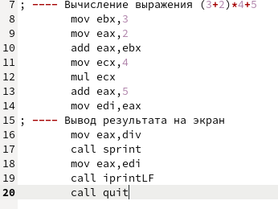{ #fig:fig35 width=70% }

36. Создаём исполняемый файл и проверяем его работу (рис. [-@fig:fig36]):

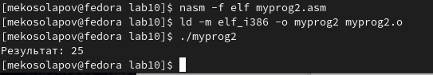{ #fig:fig36 width=70% }

# Выводы

В ходе данной лабораторной работы я научился работать с программой отладки кода, приобрёл навыки написания программ с использованием подпрограмм.

# Список литературы{.unnumbered}

::: {#refs}
:::
