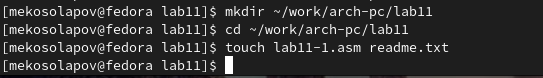
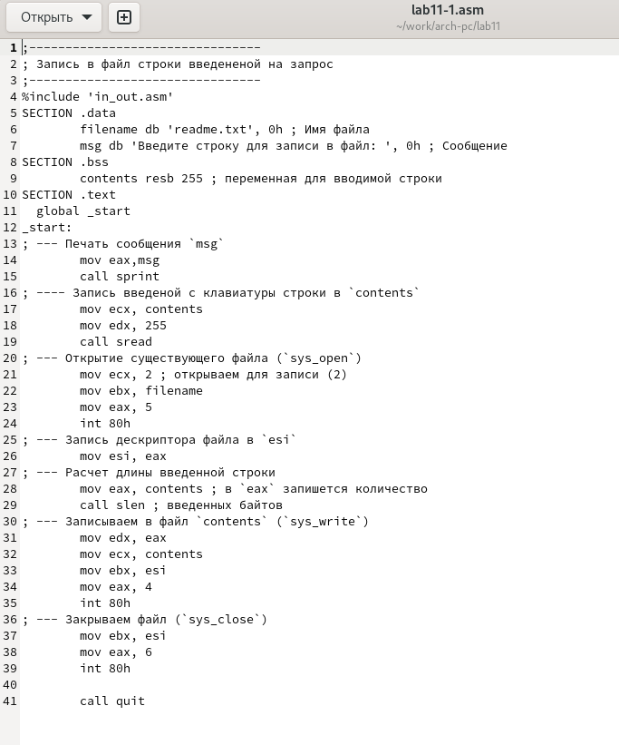
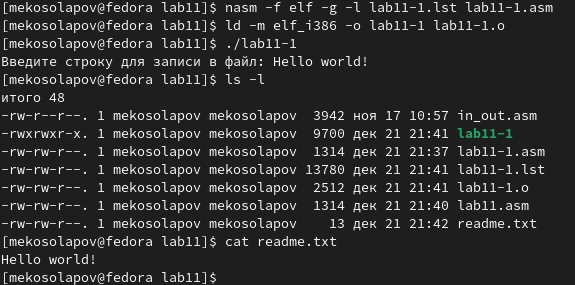
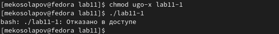
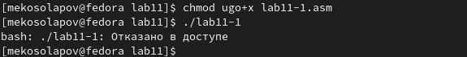
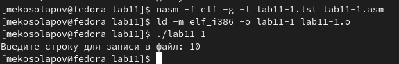
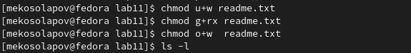
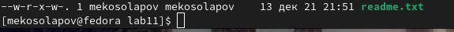
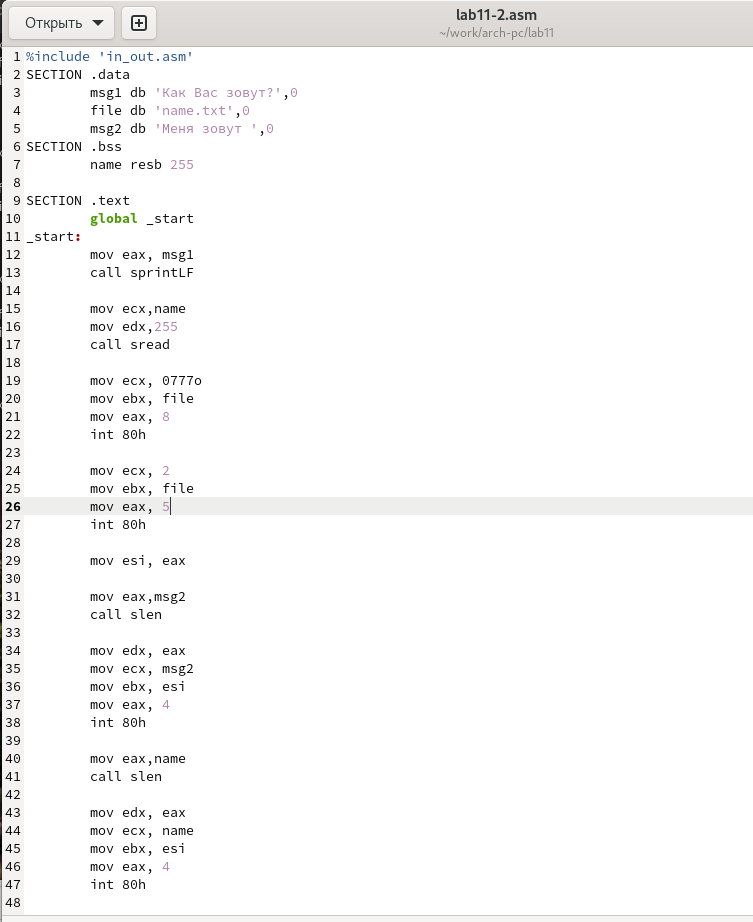
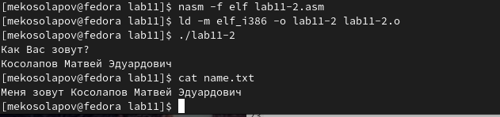

---
## Front matter
title: "Лабораторная работа №11"
subtitle: "Архитектура компьютера"
author: "Косолапов Матвей Эдуадович"

## Generic otions
lang: ru-RU
toc-title: "Содержание"

## Bibliography
bibliography: bib/cite.bib
csl: pandoc/csl/gost-r-7-0-5-2008-numeric.csl

## Pdf output format
toc: true # Table of contents
toc-depth: 2
lof: true # List of figures
lot: true # List of tables
fontsize: 12pt
linestretch: 1.5
papersize: a4
documentclass: scrreprt
## I18n polyglossia
polyglossia-lang:
  name: russian
  options:
	- spelling=modern
	- babelshorthands=true
polyglossia-otherlangs:
  name: english
## I18n babel
babel-lang: russian
babel-otherlangs: english
## Fonts
mainfont: PT Serif
romanfont: PT Serif
sansfont: PT Sans
monofont: PT Mono
mainfontoptions: Ligatures=TeX
romanfontoptions: Ligatures=TeX
sansfontoptions: Ligatures=TeX,Scale=MatchLowercase
monofontoptions: Scale=MatchLowercase,Scale=0.9
## Biblatex
biblatex: true
biblio-style: "gost-numeric"
biblatexoptions:
  - parentracker=true
  - backend=biber
  - hyperref=auto
  - language=auto
  - autolang=other*
  - citestyle=gost-numeric
## Pandoc-crossref LaTeX customization
figureTitle: "Рис."
tableTitle: "Таблица"
listingTitle: "Листинг"
lofTitle: "Список иллюстраций"
lotTitle: "Список таблиц"
lolTitle: "Листинги"
## Misc options
indent: true
header-includes:
  - \usepackage{indentfirst}
  - \usepackage{float} # keep figures where there are in the text
  - \floatplacement{figure}{H} # keep figures where there are in the text
---

# Цель работы

Приобретение навыков написания программ для работы с файлами.

# Задание

# Теоретическое введение

# Выполнение лабораторной работы

1. Cоздаём каталог lab11, в нём создаём файл lab11-1.asm и файл readme.txt(рис. [-@fig:fig01]):

{ #fig:fig01 width=70% }

2. Переносим в файл программу из листинга №11.1(рис. [-@fig:fig02]):

{ #fig:fig02 width=70% }

3. Создаём исполняемый файл, проверяем работу. (рис. [-@fig:fig03]):

{ #fig:fig03 width=70% }

4. Изменяем права доступа к исполняемому файлу lab11-1, запрещаем его выполнение с помощью команды *chmod*. Пытаемся запустить файл и видим отказ в доступе. Всё правильно, мы же тольок что запретили всем доступ к этому файлу (рис. [-@fig:fig04]):

{ #fig:fig04 width=70% }

5.  Теперь добавляем права на исполнение файла lab11-1.asm. Снова пытаемся запустить исполняемый файл и опять видим отказ в доступе. Всё правильно, ведь мы изменили права достуа не к исполняемому файлу, а к исходному файлу(рис. [-@fig:fig05]):

{ #fig:fig05 width=70% }

6. Если мы оттранслируем файл lab11-1.asm в исполняемый и попробуем запустить, то никаких запретов не будет. Ведь теперь на исполняемом файле не стоит право запрета на исполнение(рис. [-@fig:fig06]):

{ #fig:fig06 width=70% }

7. Теперь предоставим права доступа к файлу *readme.txt*, предложенные ***6*** варианту (w- r-x -w- ). Я сделал это не одной, а тремя командами *chmod* (рис. [-@fig:fig07])

{ #fig:fig07 width=70% }

8. Проверяем правильность заданных прав с помощью команды *ls -l*. Отлично, всё хорошо.(рис. [-@fig:fig08])

{ #fig:fig08 width=70% }

***Задания для самостоятельной работ***
9. Пишем программу, которая будет запрашивать имя, принимать имя и записывать его в созданный файл(рис. [-@fig:fig09]):

{ #fig:fig09 width=70% }

10. Создаём исполняемый файл и проверяем его работу. С помощью команды *cat* проверяем, действительно ли имя было записано в файл (рис. [-@fig:fig10]):

{ #fig:fig10 width=70% }

# Выводы

В ходе данной лабораторной работы я научился создавать файлы, открывать и закрывать их, записывать в них какие-либо данные, считывать какие-либо данные. Также научился управлять правами доступа к файлам. С приобретёнными за всё время знаниями я способен написать какую-нибудь функциональную программу.

# Список литературы{.unnumbered}

::: {#refs}
:::
